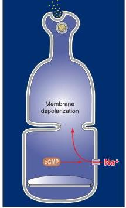
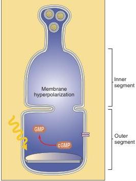
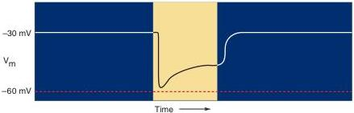

(a) Dark

(b) Light

FIGURE 9.17

The hyperpolarization of photoreceptors in response to light. Photoreceptors are continuously depolarized in the dark because of an inward sodium current, the dark current.

(a) Sodium enters the photoreceptor through a cGMP-gated channel. (b) Light leads to the activation of an enzyme that destroys cGMP, thereby shutting off the $\mathrm{Na^{+}}$ current and hyperpolarizing the cell.

The hyperpolarizing response to light is initiated by the absorption of electromagnetic radiation by the photopigment in the membrane of the stacked disks in the rod outer segments. In the rods, this pigment is called **rhodopsin**. Rhodopsin can be thought of as a receptor protein with a prebound chemical agonist. The receptor protein is called *opsin*, and it has the seven transmembrane alpha helices typical of G-protein-coupled receptors throughout the body. The prebound agonist is called *retinal*, a derivative of vitamin A. The absorption of light causes a change in the conformation of retinal so that it activates the opsin (Figure 9.18). This process is called bleaching because it changes the wavelengths absorbed by the rhodopsin (the photopigment literally changes color from purple to yellow). The bleaching of rhodopsin stimulates a G-protein called **transducin** in the disk membrane, which in turn activates the effector enzyme **phosphodiesterase (PDE)**, which breaks down the cGMP that is normally present in