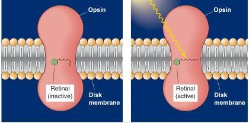
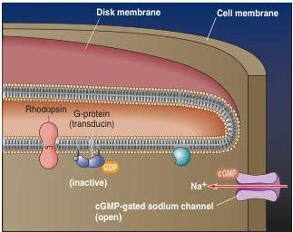
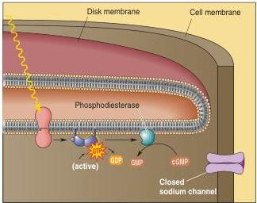

FIGURE 9.18

The activation of rhodopsin by light. Rhodopsin consists of opsin, a protein with seven transmembrane alpha helices, and retinal, a small molecule derived from vitamin A. Retinal undergoes a change in conformation when it absorbs light, thereby activating the opsin.

the cytoplasm of the rod (in the dark). The reduction in cGMP causes the Na⁺ channels to close and the membrane to hyperpolarize.

One of the interesting functional consequences of using a biochemical cascade for transduction is signal amplification. Many G-proteins are activated by each photopigment molecule, and each PDE enzyme breaks down more than one cGMP molecule. This amplification gives our visual system the ability to detect as little as a single photon, the elementary unit of light energy.

The complete sequence of events of phototransduction in rods is illustrated in Figure 9.19.

(a) Dark

(b) Light

FIGURE 9.19

The light-activated biochemical cascade in a photoreceptor. (a) In the dark, cGMP gates a sodium channel, causing an inward Na⁺ current and depolarization of the cell. (b) The activation of rhodopsin by light energy causes the G-protein (transducin) to exchange GDP for GTP (see Chapter 6), which in turn activates the enzyme phosphodiesterase (PDE). PDE breaks down cGMP and shuts off the dark current.