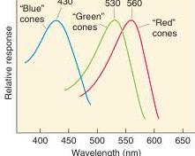
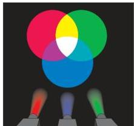

**FIGURE 9.20**
The spectral sensitivity of the three types of cone pigments.

**FIGURE 9.21**
Mixing colored lights. The mixing of red, green, and blue light causes equal activation of the three types of cones, and the perception of "white" results.

## Phototransduction in Cones

In bright sunlight, cGMP levels in rods fall to the point where the response to light becomes *saturated*; additional light causes no more hyperpolarization. Thus, vision during the day depends entirely on the cones, whose photopigments require more energy to become bleached.

The process of phototransduction in cones is virtually the same as in rods; the only major difference is in the type of opsins in the membranous disks of the cone outer segments. The cones in our retinas contain one of three opsins that give the photopigments different spectral sensitivities. Thus, we can speak of "blue" cones that are maximally activated by light with a wavelength of about 430 nm, "green" cones that are maximally activated by light with a wavelength of about 530 nm, and "red" cones that are maximally activated by light with a wavelength of about 560 nm (Figure 9.20).

**Color Detection.** The color that we perceive is largely determined by the relative contributions of blue, green, and red cones to the retinal signal. The fact that our visual system detects colors in this way was actually predicted almost 200 years ago by British physicist Thomas Young. Young showed in 1802 that all the colors of the rainbow, including white, could be created by mixing the proper ratio of red, green, and blue light (Figure 9.21). He proposed, quite correctly, that at each point in the retina there exists a cluster of three receptor types, each type being maximally sensitive to either blue, green, or red. Young's ideas were later championed by Hermann von Helmholtz, an influential nineteenth-century German physiologist. (Among his accomplishments is the invention of the ophthalmoscope in 1851.) This theory of color vision came to be known as the **Young-Helmholtz trichromacy theory**. According to the theory, the brain assigns colors based on a comparison of the readout of the three cone types. When all types of cones are equally active, as in broad-spectrum light, we perceive "white." Various forms of color blindness result when one or more of the cone photopigment types is missing (Box 9.4).

If cones alone make the perception of color possible, we should be unable to perceive color differences when cones are inactive. This inference is correct, and you can demonstrate it to yourself. Go outside on a dark night and try to distinguish the colors of different objects. It is difficult to detect colors at night because only the rods, with a single type of photopigment, are activated under dim lighting conditions. (Bright neon signs are still seen as colored because they emit sufficient light to affect the cones.) The peak sensitivity of the rods is to a wavelength of about 500 nm, perceived as blue-green (under photopic conditions). This fact is the basis for two points of view about the design of automobile dashboard indicator lights. One view is that the lights should be dim blue-green to take advantage of the spectral sensitivity of the rods. An alternate view is that the lights should be bright red because this wavelength affects mainly cones, leaving the rods unsaturated, resulting in better night vision.

## Dark and Light Adaptation

This transition from all-cone daytime vision to all-rod nighttime vision is not instantaneous; it takes about 20–25 minutes (hence the time needed to get oriented in the star-gazing exercise above). This phenomenon is called **dark adaptation**, or getting used to the dark. Sensitivity to light actually increases a millionfold or more during this period. Dark adaptation is