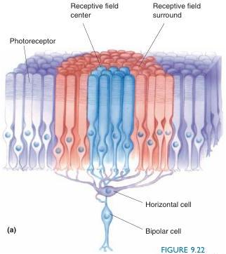
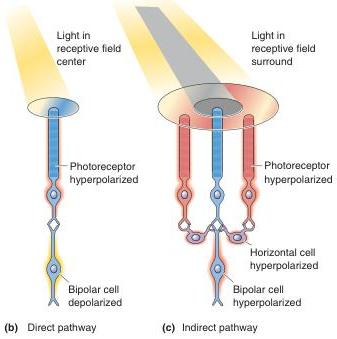

FIGURE 9.22

Direct and indirect pathways from photoreceptor to bipolar cell. (a) Bipolar cells receive direct synaptic input from a cluster of photoreceptors, constituting the receptive field center. In addition, they receive indirect input from surrounding photoreceptors via horizontal cells. (b) An ON-center bipolar cell is depolarized by light in the receptive field center via the direct pathway. (c) Light in the receptive field surround hyperpolarizes the ON-center bipolar cell via the indirect pathway. Because of the intervening horizontal cell, the effect of light on the surround photoreceptors is always opposite the effect of light on the center photoreceptors.

(an ON response), then illumination of the surround will cause an antagonistic hyperpolarization of the bipolar cell (Figure 9.22b, c). Likewise, if the cell is depolarized by a spot turning from light to dark in the center of its receptive field (an OFF response), it will be hyperpolarized by the same dark stimulus applied to the surround. Thus, these cells are said to have antagonistic center-surround receptive fields. The antagonistic surround appears to come from a complex interaction of horizontal cells, photoreceptors, and bipolar cells at their synapses.

The center-surround receptive field organization is passed on from bipolar cells to ganglion cells via synapses in the inner plexiform layer. The lateral connections of the amacrine cells in the inner plexiform layer also contribute to the elaboration of ganglion cell receptive fields and the integration of rod and cone input to ganglion cells. Numerous types of amacrine cells have been identified, and their particular contributions to ganglion cell responses are still being investigated.

## ▼ RETINAL OUTPUT

The sole source of output from the retina to the rest of the brain is the action potentials arising from the million or so ganglion cells. The activity of these cells can be recorded electrophysiologically not only in the retina but also in the optic nerve where their axons travel.