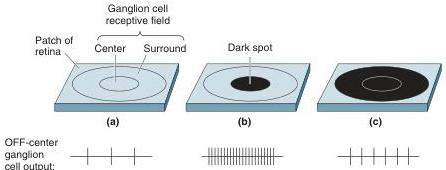

# Ganglion Cell Receptive Fields

Most retinal ganglion cells have the concentric center-surround receptive field organization discussed above for bipolar cells. ON-center and OFF-center ganglion cells receive input from the corresponding type of bipolar cell. Thus, an ON-center ganglion cell will be depolarized and respond with a barrage of action potentials when a small spot of light is projected onto the middle of its receptive field. Likewise, an OFF-center cell will respond to a small dark spot presented to the middle of its receptive field. However, in both types of cell, the response to stimulation of the center is canceled by the response to stimulation of the surround (Figure 9.23). The surprising implication is that most retinal ganglion cells are not particularly responsive to changes in illumination that include both the receptive field center and the receptive field surround. Rather, it appears that the ganglion cells are mainly responsive to differences in illumination that occur within their receptive fields.

To illustrate this point, consider the response generated by an OFF-center cell as a light-dark edge crosses its receptive field (Figure 9.24). Remember that in such a cell, dark in the center of the receptive field causes the cell to depolarize, whereas dark in the surround causes the cell to hyperpolarize. In uniform illumination, the center and surround cancel to yield some low level of response (Figure 9.24a). When the edge enters the surround region of the receptive field without encroaching on the center, the dark area has the effect of hyperpolarizing the neuron, leading to a decrease in the cell's firing rate (Figure 9.24b). As the dark area begins to include the center, however, the partial inhibition by the surround is overcome, and the cell response increases (Figure 9.24c). But when the dark area finally fills the entire surround, the center response is again canceled (Figure 9.24d). Notice that the cell response in this example is only slightly different in uniform light and in uniform dark; the response is modulated mainly by the presence of the light-dark edge in its receptive field.

Now let's consider the output of all the OFF-center ganglion cells that are stimulated by a stationary light-dark edge imaged on the retina. The responses will fall into the same four categories illustrated in Figure 9.24. Thus, the cells that will register the presence of the edge are those with receptive field centers and surrounds that are differentially affected by the light and dark areas. The population of cells with receptive field centers "viewing" the light side of the edge will be inhibited (Figure 9.24b). The population of cells with centers "viewing" the dark side of the edge will be excited (Figure

FIGURE 9.23

A center-surround ganglion cell receptive field. (a, b) An OFF-center ganglion cell responds with a barrage of action potentials when a dark spot is imaged on its receptive field center. (c) If the spot is enlarged to include the receptive field surround, the response is greatly reduced.