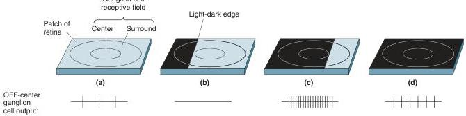

FIGURE 9.24

Responses to a light-dark edge crossing an OFF-center ganglion cell receptive field. The response of the neuron is determined by the fraction of the center and surround that are filled by light and dark. (See text for details.)

9.24c). In this way, the difference in illumination at a light-dark edge is not faithfully represented by the difference in the output of ganglion cells on either side of the edge. Instead, the center-surround organization of the receptive fields leads to a neural response that emphasizes the contrast at light-dark edges.

There are many visual illusions involving the perception of light level. The organization of ganglion cell receptive fields suggests an explanation for the illusion shown in Figure 9.25. Even though the two central squares are the same shade of gray, the square on the left background appears darker. Consider the two ON-center receptive fields shown on the gray squares. In both cases, the same gray light hits the receptive field center. However, the receptive field on the left has more light in its surround than the receptive field on the right. This will lead to a lower response and may be related to the darker appearance of the left gray square.

## Types of Ganglion Cells

Most ganglion cells in the mammalian retina have a center-surround receptive field with either an ON or an OFF center. They can be further categorized based on their appearance, connectivity, and electrophysiological properties. In the macaque monkey retina and human retina, two major types of ganglion cells are distinguished: large M-type ganglion cells and smaller P-type ganglion cells. (M stands for magno, from the Latin for

FIGURE 9.25

The influence of contrast on the perception of light and dark. The central boxes are identical shades of gray, but because the surrounding area is lighter on the left, the left central box appears darker. ON-center receptive fields are shown on the left and right of the figure. Which would respond more?