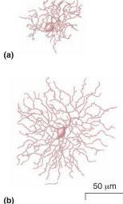
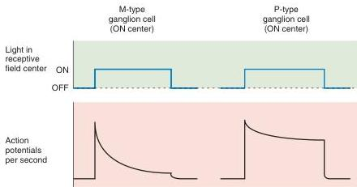

**FIGURE 9.26**
**M-type and P-type ganglion cells in the macaque monkey retina. (a)** A small P cell from the peripheral retina. **(b)** An M cell from a similar retinal location is significantly larger. (Source: Watanabe and Rodieck, 1989, pp. 437, 439.)

the relative sizes of M and P ganglion cells at the same location on the retina. P cells constitute about 90% of the ganglion cell population, M cells constitute about 5%, and the remaining 5% is made up of a variety of **nonM-nonP ganglion cell** types that are less well characterized.

The visual response properties of M cells differ from those of P cells in several ways. They have larger receptive fields, they conduct action potentials more rapidly in the optic nerve, and they are more sensitive to low-contrast stimuli. In addition, M cells respond to stimulation of their receptive field centers with a transient burst of action potentials, while P cells respond with a sustained discharge as long as the stimulus is on (Figure 9.27). We will see in Chapter 10 that the different types of ganglion cells appear to play different roles in visual perception.

**Color-Opponent Ganglion Cells.** Another important distinction between ganglion cell types is that some P cells and nonM-nonP cells are sensitive to differences in the wavelength of light. The majority of these color-sensitive neurons are called **color-opponent cells**, reflecting the fact that the response to one wavelength in the receptive field center is canceled by showing another wavelength in the receptive field surround. Two types of opponency are found, red versus green and blue versus yellow. Consider, for example, a cell with a red ON center and a green OFF surround (Figure 9.28). The center of the receptive field is fed mainly by red cones; therefore, the cell responds to red light by firing action potentials. Note that even a red light that bathes the entire receptive field is an effective stimulus. However, the response is reduced because red light has some effect on green cones (recall the overlap of the red and green sensitivity curves in Figure 9.20) that feed into the green OFF surround. The response to red is only canceled by green light on the surround. Shorthand notation for such a cell is $R^+G^-$, meaning simply that it is excited by red in the receptive field center, and this response is inhibited by green in the surround. What would be the response to white light on the entire receptive field? Because white light contains all visible wavelengths, both center and surround would be equally activated, thereby canceling the response of the cell.

Blue-yellow color opponency works the same way. Consider a cell with a blue ON center and a yellow OFF surround ($B^+Y^-$). Blue light drives blue cones that feed the receptive field center, while yellow light activates both

**FIGURE 9.27**
**Different responses to light of M-type and P-type ganglion cells.**