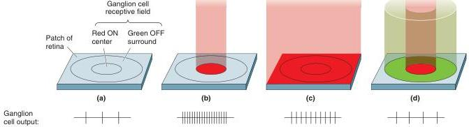
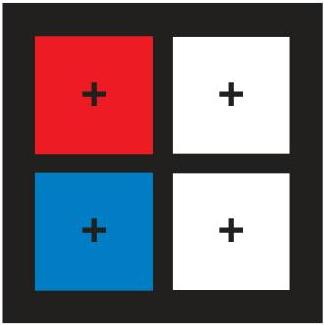

FIGURE 9.28

A color-opponent center-surround receptive field of a P-type ganglion cell.

red and green cones that feed the surround. Again, diffuse blue light would be an effective stimulus for this cell, but yellow on the surround would cancel the response, as would diffuse white light. The lack of color opponency in M cells is accounted for by the fact that both the center and surround of the receptive field receive input from more than one type of cone.

Perceived color is based on the relative activity of ganglion cells whose receptive field centers receive input from red, green, and blue cones. Demonstrate this to yourself by fixating on the cross in the middle of the red box in Figure 9.29 for a minute or so. This will have the effect of light-adapting some of your red cones. Then look at the white box. The activation of the green cones by the white light is unopposed, and you see a green square. Similarly, if you fixate on the blue box, you will see yellow when you shift your gaze to the white box. Thus, it appears that the

FIGURE 9.29

Color opponency revealed. Fixate on the cross in the red box on the left for 60 seconds, then shift your gaze to the cross in the white box. What color do you see? Try it again with the blue box.