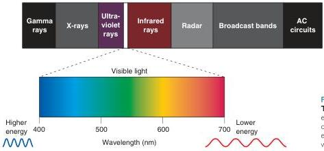
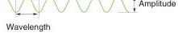

Chapter 10, we will pick up the visual pathway at the back of the eye and take it through the thalamus to the cerebral cortex.

# ▼ PROPERTIES OF LIGHT

The visual system uses light to form images of the world around us. Let's briefly review the physical properties of light and its interactions with the environment.

# Light

Electromagnetic radiation is all around us. It comes from innumerable sources, including radio antennas, mobile phones, X-ray machines, and the sun. Light is the electromagnetic radiation that is visible to our eyes. Electromagnetic radiation can be described as a wave of energy. Like any wave, electromagnetic radiation has a wavelength, the distance between successive peaks or troughs; a frequency, the number of waves per second; and an amplitude, the difference between wave trough and peak (Figure 9.1).

The energy content of electromagnetic radiation is proportional to its frequency. Radiation emitted at a high frequency (short wavelengths) has the highest energy content; examples are gamma radiation emitted by some radioactive materials and X-rays used for medical imaging, with wavelengths less than 10⁻⁹ m (<1 nm). Conversely, radiation emitted at lower frequencies (longer wavelengths) has less energy; examples are radar and radio waves, with wavelengths greater than 1 mm. Only a small part of the electromagnetic spectrum is detectable by our visual system; visible light consists of wavelengths of 400–700 nm (Figure 9.2). As first shown by Isaac Newton early in the eighteenth century, the mix of wavelengths in this range emitted by the sun appears to humans as white, whereas light of a single wavelength appears as one of the colors of the rainbow. It is interesting to note that a "hot" color like red or orange consists of light with a longer wavelength, and hence has less energy, than a "cool" color like blue or violet. Clearly, colors are themselves "colored" by the brain, based on our subjective experiences.

# Optics

In a vacuum, a wave of electromagnetic radiation will travel in a straight line and thus can be described as a ray. Light rays in our environment also

FIGURE 9.1
Characteristics of electromagnetic radiation.

FIGURE 9.2
The electromagnetic spectrum. Only electromagnetic radiation with wavelengths of 400–700 nm is visible to the naked human eye. Within this visible spectrum, different wavelengths appear as different colors.