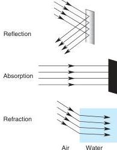
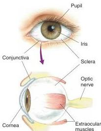

**FIGURE 9.3**
**Interactions between light and the environment.** Reflection and absorption determine what light enters the eye. Images are formed in the eye by refraction. In this example of light passing through air and then water, the light rays bend toward a line perpendicular to the air-water interface.

**FIGURE 9.4**
**Gross anatomy of the human eye.**

the atmosphere and objects on the ground. These interactions include reflection, absorption, and refraction (Figure 9.3). The study of light rays and their interactions is called *optics*.

*Reflection* is the bouncing of light rays off a surface. The manner in which a ray of light is reflected depends on the angle at which it strikes the surface. A ray striking a mirror perpendicularly is reflected 180° back upon itself, a ray striking the mirror at a 45° angle is reflected 90°, and so on. Most of what we see is light that has been reflected off objects in our environment.

*Absorption* is the transfer of light energy to a particle or surface. You can feel this energy transfer on your skin on a sunny day, as visible light is absorbed and warms you up. Surfaces that appear black absorb the energy of all visible wavelengths. Some compounds absorb light energy only in a limited range of wavelengths, then reflect the remaining wavelengths. This property is the basis for the colored pigments of paints. For example, a blue pigment absorbs long wavelengths but reflects a range of short wavelengths centered on 430 nm that are perceived as blue. As we will see in a moment, light-sensitive photoreceptor cells in the retina contain pigments and use the energy absorbed from light to generate changes in membrane potential.

Images are formed in the eye by **refraction**, the bending of light rays that can occur when they travel from one transparent medium to another. Consider a ray of light passing from the air into a pool of water. If the ray strikes the water surface perpendicularly, it will pass through in a straight line. However, if light strikes the surface at an angle, it will bend toward a line that is perpendicular to the surface. This bending of light occurs because the speed of light differs in the two media; light passes through air more rapidly than through water. The greater the difference between the speed of light in the two media, the greater the angle of refraction. The transparent media in the eye bend light rays to form images on the retina.

# ▼ THE STRUCTURE OF THE EYE

The eye is an organ specialized for the detection, localization, and analysis of light. Here we introduce the structure of this remarkable organ in terms of its gross anatomy, ophthalmoscopic appearance, and cross-sectional anatomy.

# **Gross Anatomy of the Eye**

When you look into someone's eyes, what are you really looking at? The main structures are shown in Figure 9.4. The **pupil** is the opening that allows light to enter the eye and reach the retina; it appears dark because of the light-absorbing pigments in the retina. The pupil is surrounded by the **iris**, whose pigmentation provides what we call the eye's color. The iris contains two muscles that can vary the size of the pupil; one makes it smaller when it contracts, the other makes it larger. The pupil and iris are covered by the glassy transparent external surface of the eye, the **cornea**. The cornea is continuous with the **sclera**, the "white of the eye," which forms the tough wall of the eyeball. The eyeball sits in a bony eye socket in the skull, also called the eye's orbit. Inserted into the sclera are three pairs of **extraocular muscles**, which move the eyeball in the orbit. These muscles normally are not visible because they lie behind the **conjunctiva**, a membrane that folds back from the inside of the eyelids and attaches to the sclera. The **optic nerve**, carrying axons from the retina, exits the back of the eye, passes through the orbit, and reaches the base of the brain near the pituitary gland.