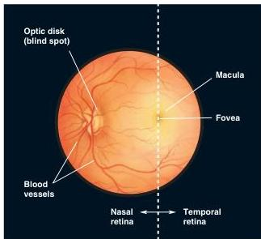

# Ophthalmoscopic Appearance of the Eye

Another view of the eye is afforded by the ophthalmoscope, a device that enables one to peer into the eye through the pupil to the retina (Figure 9.5). The most obvious feature of the retina viewed through an ophthalmoscope is the blood vessels on its surface. These retinal vessels originate from a pale circular region called the **optic disk**, which is also where the optic nerve fibers exit the retina.

It is interesting to note that the sensation of light cannot occur at the optic disk because there are no photoreceptors here, nor can it occur where the large blood vessels exist because the vessels cast shadows on the retina. And yet, our perception of the visual world appears seamless. We are not aware of any holes in our field of vision because the brain fills in our perception of these areas. However, there are tricks by which we can demonstrate the 'blind' retinal regions (Box 9.1).

At the middle of each retina is a darker-colored region with a yellowish hue. This is the **macula** (from the Latin word for 'spot'), the part of the retina for central (as opposed to peripheral) vision. Besides its color, the macula is distinguished by the relative absence of large blood vessels. Notice in Figure 9.5 that the vessels are from the optic disk to the macula; this is also the trajectory of the optic nerve fibers from the macula en route to the optic disk. The relative absence of large blood vessels in this region of the retina is one of the specializations that improves the quality of central vision. Another specialization of the central retina can sometimes be discerned with the ophthalmoscope: the **fovea**, a dark spot about 2 mm in diameter. The term is from the Latin for 'pit,' and the retina is thinner in the fovea than elsewhere. Because it marks the center of the retina, the fovea is a convenient anatomical reference point. Thus, the part of the retina that lies closer to the nose than the fovea is called nasal, the part that lies near the temple is called temporal, the part of the retina above the fovea is called superior, and that below it is called inferior.

FIGURE 9.5

**The retina, viewed through an ophthalmoscope.** The dotted line through the fovea represents the demarcation between the side of the eye nearer the nose (nasal retina) and the side of the eye nearer the ear (temporal retina).