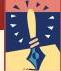

Box 9.1

OF SPECIAL INTEREST

## Demonstrating the Blind Regions of Your Eye

A look through an ophthalmoscope reveals that there is a sizable hole in the retina. The region where the optic nerve axons exit the eye and the retinal blood vessels enter the eye, the optic disk, is completely devoid of photoreceptors. Moreover, the blood vessels coursing across the retina are opaque and block the light from falling on photoreceptors beneath them. Although we normally don't notice them, these blind regions can be demonstrated. Look at Figure A. Hold the book about 1.5 ft away, close your right eye, and fixate on the cross with your left eye. Move the book (or your head) around slightly, and eventually you will find a position where the black circle disappears. At this position, the spot is imaged on the optic disk of the left eye. This region of visual space is called the *blind spot* for the left eye.

The blood vessels are a little tricky to demonstrate, but give this a try. Get a standard household flashlight. In a dark or dimly lit room, close your left eye (it helps to hold the eye closed with your finger so you can open your

right eye further). Look straight ahead with the open right eye, and shine the flashlight at an angle into the corner of the eye from the side. Jiggle the light back and forth, up and down. If you're lucky, you'll see an image of your own retinal blood vessels. This is possible because the illumination of the eye at this oblique angle causes the retinal blood vessels to cast long shadows on the adjacent regions of retina. For the shadows to be visible, they must be swept back and forth on the retina, hence the jiggling of the light.

If we have all these light-insensitive regions in the retina, why does the visual world appear uninterrupted and seamless? The answer is that mechanisms in the visual cortex appear to 'fill in' the missing regions. Perceptual filling-in can be demonstrated with the stimulus shown in Figure B. Fixate on the cross with your left eye and move the book closer and farther from your eye. You'll find a distance at which you will see a continuous uninterrupted line. At this point, the space in the line is imaged on the blind spot, and your brain fills in the gap.

FIGURE A

FIGURE B

### Cross-Sectional Anatomy of the Eye

A cross-sectional view of the eye shows the path taken by light as it passes through the cornea toward the retina (Figure 9.6). The cornea lacks blood vessels and is nourished by the fluid behind it, the **aqueous humor**. This view reveals the transparent **lens** located behind the iris. The lens is suspended by ligaments (called zonule fibers) attached to the **ciliary muscles**, which are attached to the sclera and form a ring inside the eye. As we shall see, changes in the shape of the lens enable our eyes to adjust their focus to different viewing distances.

The lens also divides the interior of the eye into two compartments containing slightly different fluids. The aqueous humor is the watery fluid that lies between the cornea and the lens. The more viscous, jellylike **vitreous humor** lies between the lens and the retina; its pressure serves to keep the eyeball spherical.