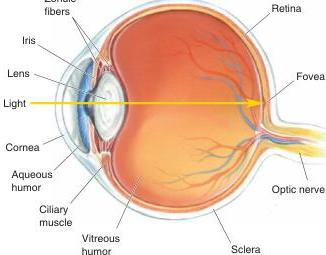

**FIGURE 9.6**

**The eye in cross section.** Structures at the front of the eye regulate the amount of light allowed in and refract the light onto the retina at the back.

Although the eyes do a remarkable job of delivering precise visual information to the rest of the brain, a variety of disorders can compromise this ability (Box 9.2).

## ▼ IMAGE FORMATION BY THE EYE

The eye collects the light rays emitted by or reflected off objects in the environment, and focuses them onto the retina to form images. Bringing objects into focus involves the combined refractive powers of the cornea and lens. You may be surprised to learn that the cornea, rather than the lens, is the site of most of the refractive power of the eyes.

### Refraction by the Cornea

Consider the light emitted from a distant source, perhaps a bright star at night. We see the star as a point of light because the eye focuses the star's light to a point on the retina. The light rays striking the surface of the eye from a distant star are virtually parallel, so they must be bent by the process of refraction.

Recall that as light passes into a medium where its speed is slowed, it will bend toward a line that is perpendicular to the border, or interface, between the media (see Figure 9.3). This is precisely the situation as light strikes the cornea and passes from the air into the aqueous humor. As shown in Figure 9.7, the light rays that strike the curved surface of the cornea bend so that they converge on the back of the eye; those that enter the center of the eye pass straight to the retina. The distance from the refractive surface to the point where parallel light rays converge is called the *focal distance*. Focal distance depends on the curvature of the cornea—the tighter the curve, the shorter the focal distance. The equation in Figure 9.7 shows that the reciprocal of the focal distance in meters is a unit of measurement called the **diopter**. The cornea has a refractive power of about 42 diopters, which means that parallel light rays striking the corneal surface will be focused 0.024 m (2.4 cm) behind it, about the distance from cornea to retina. To get a sense of the large amount of refraction produced