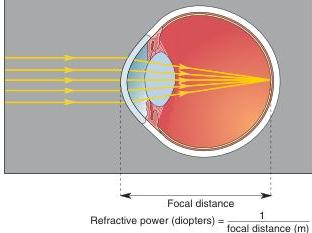
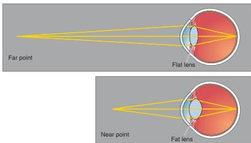

**Refraction by the cornea.** The cornea must have sufficient refractive power, measured in diopters, to focus light on the retina at the back of the eye.

by the cornea, note that many prescription eyeglasses have a power of only a few diopters.

Remember that refractive power depends on the slowing of light at the air-cornea interface. If we replace air with a medium that passes light at about the same speed as the eye, the refractive power of the cornea will be eliminated. This is why things look blurry when you open your eyes underwater; the water-cornea interface has very little focusing power. A scuba mask restores the air-cornea interface and, consequently, the refractive power of the eye.

### Accommodation by the Lens

Although the cornea performs most of the eye's refraction, the lens also contributes another dozen or so diopters to the formation of a sharp image at a distant point. However, the lens is involved more importantly in forming crisp images of objects located closer than about 9 m from the eye. As objects approach, the light rays originating at a point can no longer be considered to be parallel. Rather, these rays diverge, and greater refractive power is required to bring them into focus on the retina. This additional focusing power is provided by changing the shape of the lens, a process called **accommodation** (Figure 9.8).

**FIGURE 9.8**

**Accommodation by the lens.** To focus the eye on a distant point, relatively little refraction is required, and it is provided by a flat lens. Near objects require greater refraction provided by a more spherical lens.

