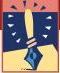
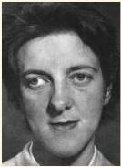
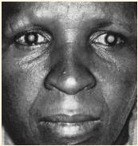

Box 9.2

OF SPECIAL INTEREST

# Eye Disorders

Once you know the basic structure of the eye, you can understand how a partial or complete loss of vision results from abnormalities in various components. For example, if there is an imbalance in the extraocular muscles of the two eyes, the eyes will point in different directions. Such a misalignment or lack of coordination between the two eyes is called strabismus, and there are two varieties. In esotropia, the directions of gaze of the two eyes cross, and the person is said to be cross-eyed. In exotropia, the directions of gaze diverge, and the person is said to be wall-eyed (Figure A). In most cases, strabismus of either type is congenital; it can and should be corrected during early childhood. Treatment usually involves the use of prismatic glasses or surgery to the extraocular muscles to realign the eyes. Without treatment, conflicting images are sent to the brain from the two eyes, degrading depth perception, and, more importantly, causing the person to suppress input from one eye. The dominant eye will be normal but the suppressed eye will become amblyopic, meaning that it has poor visual acuity. If medical intervention is delayed until adulthood, the condition cannot be corrected.

A common eye disorder among older adults is cataract, a clouding of the lens (Figure B). Many people over 65 years of age have some degree of cataract; if it significantly impairs vision, surgery is usually required. In a cataract operation, the lens is removed and replaced with an artificial plastic lens. Although the artificial lens cannot adjust its focus like the normal lens, it provides a clear image, and glasses can be used for near and far vision (see Box 9.3).

Glaucoma, a progressive loss of vision associated with elevated intraocular pressure, is a leading cause of blindness. Pressure in the aqueous humor plays a crucial role in maintaining the shape of the eye. As this pressure increases, the entire eye is stressed, ultimately damaging the relatively weak point where the optic nerve leaves the eye. The optic nerve axons are compressed, and vision is

gradually lost from the periphery inward. Unfortunately, by the time a person notices a loss of more central vision, the damage is advanced and a significant portion of the eye is permanently blind. For this reason, early detection and treatment with medication or surgery to reduce intraocular pressure are essential.

The light-sensitive retina at the back of the eye is the site of numerous disorders that pose a significant risk of blindness. You may have heard of a professional boxer having a detached retina. As the name implies, the retina pulls away from the underlying wall of the eye from a blow to the head or by shrinkage of the vitreous humor. Once the retina has started to detach, fluid from the vitreous space flows through small tears in the retina resulting from the trauma, thereby causing more of the retina to separate. Symptoms of retinal detachment include abnormal perception of shadows and flashes of light. Treatment often involves laser surgery to scar the edge of the retinal tear, thereby reattaching the retina to the back of the eye.

Retinitis pigmentosa is characterized by a progressive degeneration of the photoreceptors. The first sign is usually a loss of peripheral vision and night vision. Subsequently, total blindness may result. The cause of this disease is unknown. In some forms, it clearly has a strong genetic component, and more than 100 genes have been identified that can contain mutations leading to retinitis pigmentosa. There is currently no cure, but taking vitamin A may slow its progression.

In contrast to the tunnel vision typically experienced by patients with retinitis pigmentosa, people with macular degeneration lose only central vision. The condition is quite common, affecting more than 25% of all Americans over 65 years of age. While peripheral vision usually remains normal, the ability to read, watch television, and recognize faces is lost as central photoreceptors gradually deteriorate. Laser surgery can sometimes minimize further vision loss, but the disease currently has no known cure.

FIGURE A
Exotropia. (Source: Newell, 1965, p. 330.)

FIGURE B
Cataract. (Source: Schwab, 1987, p. 22.)