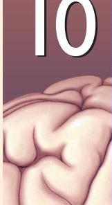

# The Central Visual System

## INTRODUCTION

### THE RETINOFUGAL PROJECTION

THE OPTIC NERVE, OPTIC CHIASM, AND OPTIC TRACT

RIGHT AND LEFT VISUAL HEMIFIELDS

TARGETS OF THE OPTIC TRACT

■ Box 10.1 *Of Special Interest:* David and Goliath

*Nonthalamic Targets of the Optic Tract*

### THE LATERAL GENICULATE NUCLEUS

THE SEGREGATION OF INPUT BY EYE AND BY GANGLION CELL TYPE

RECEPTIVE FIELDS

NONRETINAL INPUTS TO THE LGN

### ANATOMY OF THE STRIATE CORTEX

RETINOTOPY

LAMINATION OF THE STRIATE CORTEX

*The Cells of Different Layers*

INPUTS AND OUTPUTS OF THE STRIATE CORTEX

*Ocular Dominance Columns*

*Innervation of Other Cortical Layers from Layer IVC*

*Striate Cortex Outputs*

CYTOCHROME OXIDASE BLOBS

### PHYSIOLOGY OF THE STRIATE CORTEX

RECEPTIVE FIELDS

*Binocularity*

*Orientation Selectivity*

■ Box 10.2 *Brain Food:* Optical Imaging of Neural Activity

*Direction Selectivity*

*Simple and Complex Receptive Fields*

*Blob Receptive Fields*

PARALLEL PATHWAYS AND CORTICAL MODULES

■ Box 10.3 *Path of Discovery:* Vision and Art, by Margaret Livingstone

*Parallel Pathways*

*Cortical Modules*

### BEYOND STRIATE CORTEX

THE DORSAL STREAM

*Area MT*

*Dorsal Areas and Motion Processing*

THE VENTRAL STREAM

*Area V4*

*Area IT*

### FROM SINGLE NEURONS TO PERCEPTION

■ Box 10.4 *Of Special Interest:* The Magic of Seeing in 3D

FROM PHOTORECEPTORS TO GRANDMOTHER CELLS

PARALLEL PROCESSING AND PERCEPTION

### CONCLUDING REMARKS