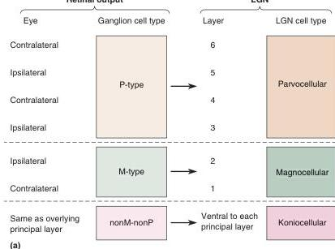
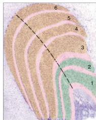

(b)

FIGURE 10.9

The organization of the LGN.

(a) Ganglion cell inputs to the different LGN layers. (b) A thin koniocellular layer (shown in pink) is ventral to each of the six principal layers.

## Nonretinal Inputs to the LGN

What makes the similarity of LGN and ganglion cell receptive fields so surprising is that the retina is not the main source of synaptic input to the LGN. The major input, constituting about 80% of the excitatory synapses, comes from primary visual cortex. Thus, one might reasonably expect that this corticofugal feedback pathway would significantly alter the qualities of the visual responses recorded in the LGN. So far, however, a role for this massive input has not been clearly identified.

The LGN also receives synaptic inputs from neurons in the brain stem whose activity is related to alertness and attentiveness (see Chapters 15 and 19). Have you ever “seen” a flash of light when you are startled in a dark room? This perceived flash might be a result of the direct activation of LGN neurons by this pathway. Usually, however, this input does not directly evoke action potentials in LGN neurons. But it can powerfully modulate the magnitude of LGN responses to visual stimuli. (Recall modulation from Chapters 5 and 6.) Thus, the LGN is more than a simple relay from retina to cortex; it is the first site in the ascending visual pathway where what we see is influenced by how we feel.

## ▼ ANATOMY OF THE STRIATE CORTEX

The LGN has a single major synaptic target: primary visual cortex. Recall from Chapter 7 that the cortex may be divided into a number of distinct areas based on their connections and cytoarchitecture. **Primary visual cortex** is Brodmann’s **area 17** and is located in the occipital lobe of the primate brain. Much of area 17 lies on the medial surface of the hemisphere, surrounding the calcarine fissure (Figure 10.10). Other terms used interchangeably to describe the primary visual cortex are **V1** and **striate cortex**. (The term *striate* refers to the fact that area V1 has an unusually dense stripe of myelinated axons running parallel to the surface that appears white in unstained sections.)