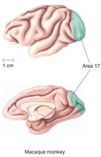
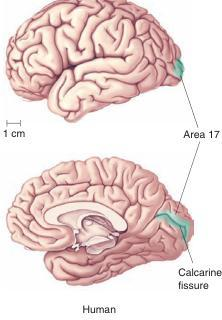

Primary visual cortex. Top views are lateral; bottom views are medial.

We have seen that the axons of different types of retinal ganglion cells synapse on anatomically segregated neurons in the LGN. In this section, we look at the anatomy of the striate cortex and trace the connections different LGN cells make with cortical neurons. In a later section, we explore how this information is analyzed by cortical neurons. As we did in the LGN, in striate cortex we'll see a close correlation between structure and function.

## Retinotopy

The projection starting in the retina and extending to LGN and V1 illustrates a general organizational feature of the central visual system called retinotopy. **Retinotopy** is an organization whereby neighboring cells in the retina feed information to neighboring places in their target structures—in this case, the LGN and striate cortex. In this way, the two-dimensional surface of the retina is *mapped* onto the two-dimensional surface of the subsequent structures (Figure 10.11a).

There are three important points to remember about retinotopy. First, the mapping of the visual field onto a retinotopically organized structure is often distorted, because visual space is not sampled uniformly by the cells in the retina. Recall from Chapter 9 that there are many more ganglion cells with receptive fields in or near the fovea than in the periphery. Thus, the representation of the visual field is distorted in striate cortex: The central few degrees of the visual field are overrepresented, or *magnified*, in the retinotopic map (Figure 10.11b).

The second point to remember is that a discrete point of light can activate many cells in the retina, and often many more cells in the target structure, due to the overlap of receptive fields. The image of a point of light on the retina actually activates a large population of cortical neurons; every neuron that contains that point in its receptive field is potentially activated. Thus, when the retina is stimulated by a point of light, the activity in striate cortex is a broad distribution with a peak at the corresponding retinotopic location.