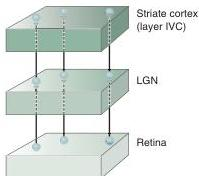
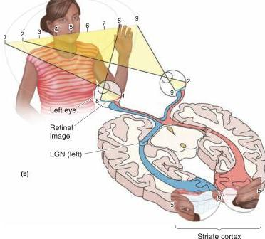

(a)

(b)

FIGURE 10.11

**The retinotopic map in striate cortex. (a)** Neighboring locations on the retina project to neighboring locations in the LGN. This retinotopic representation is preserved in the LGN projection to V1. **(b)** The lower portion of V1 represents information about the top half of visual space, and the upper portion of V1 represents the bottom half of visual space. Notice also that the map is distorted, with more tissue devoted to analysis of the central visual field. Similar maps are found in the superior colliculus, LGN, and other visual cortical areas.

Finally, don't be misled by the word 'map.' There are no pictures in the primary visual cortex for a little person in our brain to look at. While it's true that the arrangement of connections establishes a mapping between the retina and V1, perception is based on the brain's interpretation of distributed patterns of activity, not literal snapshots of the world. (We discuss visual perception later in this chapter.)

### Lamination of the Striate Cortex

The neocortex in general, and striate cortex in particular, have neuronal cell bodies arranged into about a half-dozen layers. These layers can be seen clearly in a Nissl stain of the cortex, which, as described Chapter 2, leaves a deposit of dye (usually blue or violet) in the soma of each neuron. Starting at the white matter (containing the cortical input and output fibers), the cell layers are named by Roman numerals VI, V, IV, III, and II. Layer I, just under the pia mater, is largely devoid of neurons and consists almost entirely of axons and dendrites of cells in other layers (Figure 10.12). The full thickness of the striate cortex from white matter to pia is about 2 mm, the height of the lowercase letter m.

As Figure 10.12 shows, describing the lamination of striate cortex as a six-layer scheme is somewhat misleading. There are actually at least nine distinct layers of neurons. To maintain Brodmann's convention that neocortex has six layers, however, neuroanatomists combine three sublayers into layer IV, labeled IVA, IVB, and IVC. Layer IVC is further divided into two tiers called IVC$\alpha$ and IVC$\beta$. The anatomical segregation of neurons into