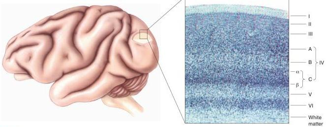
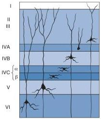

FIGURE 10.12

The cytoarchitecture of the striate cortex. The tissue has been Nissl stained to show cell bodies, which appear as dots. (Source: Adapted from Hubel, 1988, p. 97.)

layers suggests that there is a division of labor in the cortex, similar to what we saw in the LGN. We can learn a lot about how the cortex handles visual information by examining the structure and connections of its different layers.

The Cells of Different Layers. Many different neuronal shapes have been identified in striate cortex, but here we focus on two principal types, defined by the appearance of their dendritic trees (Figure 10.13). Spiny stellate cells are small neurons with spine-covered dendrites that radiate out from the cell body (recall dendritic spines from Chapter 2). They are seen primarily in the two tiers of layer IVC. Outside layer IVC are many pyramidal cells. These neurons are also covered with spines and are characterized by a single thick apical dendrite that branches as it ascends toward the pia mater and by multiple basal dendrites that extend horizontally.

Notice that a pyramidal cell in one layer may have dendrites extending into other layers. It is important to remember that only pyramidal cells send axons out of striate cortex to form connections with other parts of the brain. The axons of stellate cells make local connections only within the cortex.

In addition to the spiny neurons, inhibitory neurons, which lack spines, are sprinkled in all cortical layers as well. These neurons form only local connections.

### Inputs and Outputs of the Striate Cortex

The distinct lamination of the striate cortex is reminiscent of the layers we saw in the LGN. In the LGN, every layer receives retinal afferents and sends efferents to the visual cortex. In the visual cortex, the situation is different; only a subset of the layers receives input from the LGN or sends output to a different cortical or subcortical area.

Axons from the LGN terminate in several different cortical layers, with the largest number going to layer IVC. We've seen that the output of the LGN is divided into streams of information, for example, from the magnocellular and parvocellular layers serving the right and left eyes. These streams remain anatomically segregated in layer IVC.

FIGURE 10.13

The dendritic morphology of some cells in striate cortex. Notice particularly that pyramidal cells are found in layers III, IVB, V, and VI and that spiny stellate cells are found in layer IVC.