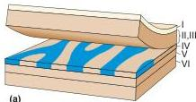
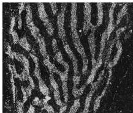
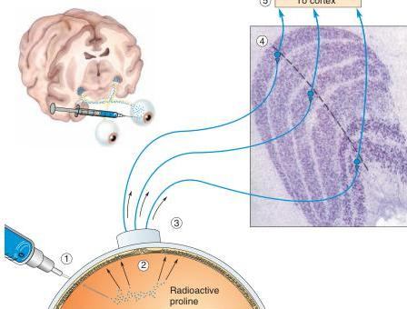

### Transneuronal autoradiography.

Radioactive proline is ① injected into one eye, where it is ② taken up by retinal ganglion cells and incorporated into proteins that are ③ transported down the axons to the LGN. Some radioactivity spills out of the retinal terminals and is ④ taken up by LGN neurons that then ⑤ transport it to striate cortex. The location of radioactivity can be determined using autoradiography.

**FIGURE 10.15**
**Ocular dominance columns in striate cortex.** (a) The organization of ocular dominance columns in layer IV of macaque monkey striate cortex. The distribution of LGN axons serving one eye is shaded blue. In cross section, these eye-specific zones appear as patches, each about 0.5 mm wide, in layer IV. Peeled-back layers reveal that the ocular dominance columns in layer IV look like zebra stripes. (b) An autoradiograph of a histological section of layer IV viewed from above. Two weeks prior to the experiment, one eye of this monkey was injected with radioactive proline. In the autoradiograph, the radioactive LGN terminals appear bright on a dark background. (Source: LeVay et al., 1980.)

Magnocellular LGN neurons project to layer IVCα, and parvocellular LGN neurons project to layer IVCβ. Imagine that the two tiers of layer IVC are pancakes, stacked one (α) on top of the other (β). Because the input from the LGN to the cortex is arranged topographically, we see that layer IVC contains two overlapping retinotopic maps, one from the magnocellular LGN (IVCα) and the other from the parvocellular LGN (IVCβ). Koniocellular LGN axons follow a different path, bypassing layer IV to make synapses in layers II and III.

**Ocular Dominance Columns.** How are the left eye and right eye LGN inputs segregated when they reach layer IVC of striate cortex? The answer was provided by a ground-breaking experiment performed in the early 1970s at Harvard Medical School by neuroscientists David Hubel and Torsten Wiesel. They injected a radioactive amino acid into one eye of a monkey (Figure 10.14). This amino acid was incorporated into proteins by the ganglion cells, and the proteins were transported down the ganglion cell axons into the LGN (recall anterograde transport from Chapter 2). Here, the radioactive proteins spilled out of the ganglion cell axon terminals and were taken up by nearby LGN neurons. But not all LGN cells took up the radioactive material; only those cells that were postsynaptic to the inputs from the injected eye incorporated the labeled protein. These cells then transported the radioactive proteins to their axon terminals in layer IVC of striate cortex. The location of the radioactive axon terminals was visualized by first placing a film of emulsion over thin sections of striate cortex and later developing the emulsion like a photograph, a process called *autoradiography* (introduced in Chapter 6). The resulting collection of silver grains on the film marked the location of the radioactive LGN inputs.

In sections cut perpendicular to the cortical surface, Hubel and Wiesel observed that the distribution of axon terminals relaying information from the injected eye was not continuous in layer IVC, but rather was split up into a series of equally spaced patches, each about 0.5 mm wide (Figure 10.15a). These patches were termed **ocular dominance columns**.