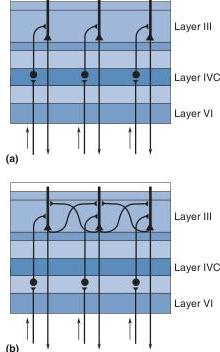
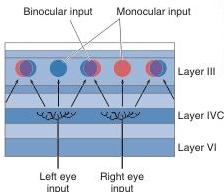
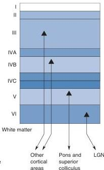

layer IV. This revealed that the left eye and right eye inputs to layer IV are laid out as a series of alternating bands, like the stripes of a zebra (Figure 10.15b).

**Innervation of Other Cortical Layers from Layer IVC.** Most intracortical connections extend perpendicular to the cortical surface along radial lines that run across the layers, from white matter to layer I. This pattern of *radial connections* maintains the retinotopic organization established in layer IV. Therefore, a cell in layer VI, for example, receives information from the same part of the retina as does a cell above it in layer IV (Figure 10.16a). However, the axons of some layer III pyramidal cells extend collateral branches that make *horizontal connections* within layer III (Figure 10.16b). Radial and horizontal connections play different roles in the analysis of the visual world, as we'll see later in the chapter.

Layer IVC stellate cells project axons radially up mainly to layers IVB and III where, for the first time, information from the left eye and right eye begins to mix (Figure 10.17). Whereas all layer IVC neurons receive only monocular input, most neurons in layers II and III receive binocular input coming from both eyes. Even so, there continues to be considerable anatomical segregation of the magnocellular and parvocellular processing streams. Layer IVCα, which receives magnocellular LGN input, projects mainly to cells in layer IVB. Layer IVCβ, which receives parvocellular LGN input, projects mainly to layer III. In layers III and IVB, an axon may form synapses with the dendrites of pyramidal cells of all layers.

**Striate Cortex Outputs.** As previously mentioned, the pyramidal cells send axons out of striate cortex into the white matter. The pyramidal cells in different layers innervate different structures. Layer II, III, and IVB pyramidal cells send their axons to other cortical areas. Layer V pyramidal cells send axons all the way down to the superior colliculus and pons. Layer VI pyramidal cells give rise to the massive axonal projection back to the LGN (Figure 10.18). Pyramidal cell axons in all layers also branch and form local connections in the cortex.

**FIGURE 10.16**
**Patterns of intracortical connections.**
(a) Radial connections. (b) Horizontal connections.

**FIGURE 10.17**
**The mixing of information from the two eyes.** Axons project from layer IVC to more superficial layers. Most layer III neurons receive binocular input from both left and right eyes.

**FIGURE 10.18**
**Patterns of outputs from the striate cortex.**