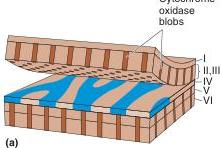
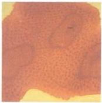

(b)

FIGURE 10.19

Cytochrome oxidase blobs. (a) The organization of cytochrome oxidase blobs in macaque monkey striate cortex. (b) A photograph of a histological section of layer III, stained for cytochrome oxidase and viewed from above. (Source: Courtesy of Dr. S. H. C. Hendry.)

# Cytochrome Oxidase Blobs

As we have seen, layers II and III play a key role in visual processing, providing most of the information that leaves V1 for other cortical areas. Anatomical studies suggest that the V1 output comes from two distinct populations of neurons in the superficial layers. When striate cortex is stained to reveal the presence of cytochrome oxidase, a mitochondrial enzyme used for cell metabolism, the stain is not uniformly distributed in layers II and III. Rather, the cytochrome oxidase staining in cross sections of striate cortex appears as a colonnade, a series of pillars at regular intervals, running the full thickness of layers II and III and also in layers V and VI (Figure 10.19a). When the cortex is sliced tangentially through layer III, these pillars appear like the spots of a leopard (Figure 10.19b). These pillars of cytochrome oxidase-rich neurons have come to be called blobs. The blobs are in rows, each blob centered on an ocular dominance stripe in layer IV. Between the blobs are "interblob" regions. The blobs receive direct LGN input from the koniocellular layers, as well as parvocellular and magnocellular input from layer IVC of striate cortex.

# ▼ PHYSIOLOGY OF THE STRIATE CORTEX

Beginning in the early 1960s, Hubel and Wiesel were the first to systematically explore the physiology of striate cortex with microelectrodes. They were students of Stephen Kuffler, who was then at Johns Hopkins University and later moved with them to Harvard. They extended Kuffler's innovative methods of receptive field mapping to the central visual pathways. After showing that LGN neurons behave much like retinal ganglion cells, they turned their attention to striate cortex, initially in cats and later in monkeys. (Here we focus on the monkey cortex.) The work that continues today on the physiology of striate cortex is built on the solid foundation provided by Hubel and Wiesel's pioneering studies. Their contributions to our understanding of the cerebral cortex were recognized with the Nobel Prize in 1981.

# Receptive Fields

By and large, the receptive fields of neurons in layer IVC are similar to the magnocellular and parvocellular LGN neurons providing their input. This means they are generally small monocular center-surround receptive fields. In layer IVCα the neurons are insensitive to the wavelength of light, whereas in layer IVCβ the neurons exhibit center-surround color opponency. Outside layer IVC, new receptive field characteristics, not observed in the retina or LGN, are found. We will explore these in some depth, because they provide clues about the role V1 plays in visual processing and perception.

Binocularity. Each neuron in layers IVCα and IVCβ receives afferents from a layer of the LGN representing either eye. Monocular neurons from either eye are also clumped together in V1 rather than randomly intermixed. This accounts for ocular dominance columns that can be visualized in layer IVC with autoradiography. As we have already seen, the axons leaving layer IVC diverge and innervate more superficial cortical layers. As a consequence of the divergence, there is a mixing of inputs from the two eyes (see Figure 10.17). Microelectrode recordings confirm this anatomical fact; most neurons in layers superficial to IVC are binocular, responding to light in either eye. We say that the neurons have binocular receptive