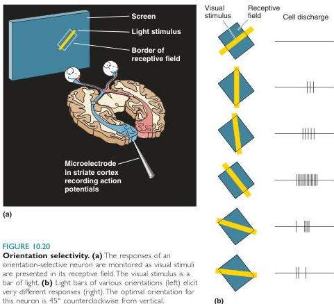

ipsilateral and one in the contralateral eye.

The construction of binocular receptive fields is essential in binocular animals, such as humans. Without binocular neurons, we would probably be unable to use the inputs from both eyes to form a single image of the world around us. Retinotopy is preserved because the two receptive fields of a binocular neuron are precisely placed on the retina such that they are 'looking' at the same point in space. We still speak of ocular dominance columns in superficial cortical layers. However, now instead of the sharp monocular columns of layer IVC, there are patches of neurons that are more strongly driven by one eye than the other (i.e., they are dominated by one eye), even though they are binocular.

**Orientation Selectivity.** Most of the receptive fields in the retina, LGN, and layer IVC are circular and give their greatest response to a spot of light matched in size to the receptive field center. Outside layer IVC, we encounter cells that no longer follow this pattern. While small spots can elicit a response from many cortical neurons, it is usually possible to produce a much greater response with other stimuli. Rather by accident, Hubel and Wiesel found that many neurons in V1 respond best to an elongated bar of light moving across their receptive fields. But the orientation of the bar is critical. The greatest response is given to a bar with a particular orientation; perpendicular bars generally elicit much weaker responses (Figure 10.20). Neurons having this type of response are said to exhibit **orientation selectivity**. Most of the V1 neurons outside layer IVC (and

FIGURE 10.20

**Orientation selectivity.** (a) The responses of an orientation-selective neuron are monitored as visual stimuli are presented in its receptive field. The visual stimulus is a bar of light. (b) Light bars of various orientations (left) elicit very different responses (right). The optimal orientation for this neuron is 45° counterclockwise from vertical.