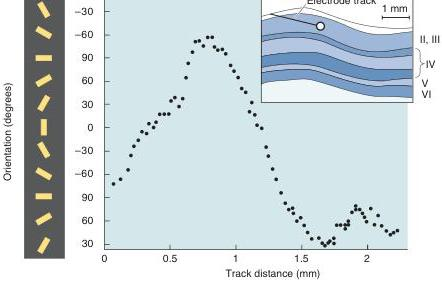

Systematic variation of orientation preferences across striate cortex. As an electrode is advanced tangentially across layer III of striate cortex, the orientation preference of the neurons encountered is recorded and plotted. Notice that there is a periodic, regular shift in preferred orientation. (Source: Adapted from Hubel and Wiesel, 1968.)

some within) are orientation selective. The optimal orientation for a neuron can be any angle around the clock.

If V1 neurons can have any optimal orientation, you might wonder whether the orientation selectivity of nearby neurons is related. From the earliest work of Hubel and Wiesel, the answer to this question was an emphatic yes. As a microelectrode is advanced radially (perpendicular to the surface) from one layer to the next, the preferred orientation remains the same for all the selective neurons encountered from layer II down through layer VI. Hubel and Wiesel called such a radial column of cells an orientation column.

As an electrode passes tangentially (parallel to the surface) through the cortex in a single layer, the preferred orientation progressively shifts. We now know, from the use of a technique called optical imaging, that there is a mosaiclike pattern of optimal orientations in striate cortex (Box 10.2). If an electrode is passed at certain angles through this mosaic, the preferred orientation rotates like the sweep of the minute hand of a clock, from the top of the hour to ten past to twenty past, and so on (Figure 10.21). If the electrode is moved at other angles, more sudden shifts in preferred orientation occur. Hubel and Wiesel found that a complete 180° shift in preferred orientation required a traverse of about 1 mm, on average, within layer III.

The analysis of stimulus orientation appears to be one of the most important functions of striate cortex. Orientation-selective neurons are thought to be specialized for the analysis of object shape.

Direction Selectivity. Many V1 receptive fields exhibit direction selectivity; they respond when a bar of light at the optimal orientation moves perpendicular to the orientation in one direction but not in the opposite direction. Direction-selective cells in V1 are a subset of the cells that are orientation selective. Figure 10.22 shows how a direction-selective cell responds to a moving stimulus. Notice that the cell responds to an elongated stimulus swept across the receptive field, but only in a particular direction of movement. Sensitivity to the direction of stimulus motion is a hallmark of neurons receiving input from the magnocellular layers of the LGN. Direction-selective neurons are thought to be specialized for the analysis of object motion.