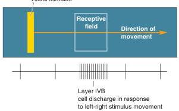
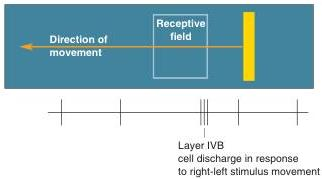
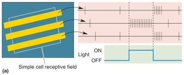
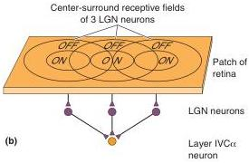

Simple and Complex Receptive Fields. Neurons in the LGN have antagonistic center-surround receptive fields, and this organization accounts for the responses of neurons to visual stimuli. For example, a small spot in the center of the receptive field may yield a much stronger response than a larger spot also covering the antagonistic surround. What do we know about the inputs to V1 neurons that might account for binocularity, orientation selectivity, and direction selectivity in their receptive fields? Binocularity is easy; we have seen that binocular neurons receive afferents from both eyes. The mechanisms underlying orientation and direction selectivity have proven more difficult to elucidate.

Many orientation-selective neurons have a receptive field elongated along a particular axis, with an ON-center or OFF-center region flanked on one or both sides by an antagonistic surround (Figure 10.23a). This linear arrangement of ON and OFF areas is analogous to the concentric antagonistic areas seen in retinal and LGN receptive fields. One gets the impression that the cortical neurons receive a converging input from three or more LGN cells with receptive fields that are aligned along one axis (Figure 10.23b). Hubel and Wiesel called neurons of this type simple cells. The segregation of ON and OFF regions is a defining property of simple cells, and it is because of this receptive field structure that they are orientation selective.

Other orientation selective neurons in V1 do not have distinct ON and OFF regions and are therefore not considered simple cells. Hubel and Wiesel called most of these complex cells, because their receptive fields appeared

FIGURE 10.22

Direction selectivity. With a bar stimulus at the optimal orientation, the neuron responds strongly when the bar is swept to the right but weakly when it is swept to the left.

FIGURE 10.23

A simple cell receptive field. (a) The response of a simple cell to optimally oriented bars of light at different locations in the receptive field. Notice that the response can be ON or OFF depending on where the bar lies in the receptive field. (b) A possible construction of a simple cell receptive field by the convergence of three LGN cell axons with center-surround receptive fields.