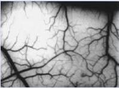
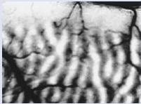
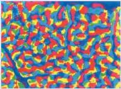

Box 10.2

BRAIN FOOD

# Optical Imaging of Neural Activity

Most of what we know about the response properties of neurons in the visual system, and every other system in the brain, has been learned from intracellular and extracellular recordings with microelectrodes. These recordings give precise information about the activity of one or a few cells. However, unless one inserts thousands of electrodes, it is not possible to observe patterns of activity across large populations of neurons.

What if we could simultaneously record signals from thousands of neurons simply by aiming a camera at the brain's surface? Incredibly, one can observe brain activity with this optical recording approach, and the resulting images have yielded new insight about the organization of the cerebral cortex. In one version of optical recording, a voltage-sensitive dye is applied to the surface of the brain. The molecules in the dye bind to cell membranes, and they change their optical properties in proportion to variations in membrane potential. The change is detected with either an array of photodetectors or a video camera. If this technique is used to record from a single neuron, the output of the optical detector is similar to an intracellular recording. In recordings from the cerebral cortex, the activity of individual neurons cannot be resolved, and the optical signal represents a summation of the changes in membrane potential of the neurons and glial cells in an area about 100 µm across.

A second way to optically study cortical activity is to image intrinsic signals. When neurons are active, numerous changes occur in the neurons themselves and in the surrounding tissue. Examples of such changes are ion movement, neurotransmitter release, and alterations in blood volume and oxygenation. Because these factors are correlated with the level of neural activity and they have (very small) effects on the reflection of light from the brain, they are called intrinsic signals for optical recording.

Thus, when intrinsic signals are used to study brain activity, membrane potentials or action potentials are not directly measured. To record intrinsic signals, light is projected onto the brain, and a video camera records the reflected light. With the wavelengths of light usually used for illumination, the intrinsic signal is dominated by changes associated with activity-dependent increases in blood volume or blood oxygen saturation. One disadvantage of this technique is that its reliance on slow vascular changes makes it incapable of the millisecond temporal resolution possible with voltage-sensitive dyes.

Figure A shows the vasculature in a portion of primary visual cortex. Figure B shows ocular dominance columns in the same patch of striate cortex obtained by imaging areas in which blood flow changes occurred during visual stimulation. This figure is actually a subtraction of two images—one made when only the right eye was visually stimulated, minus another when only the left eye was stimulated. Consequently, the dark bands represent cells dominated by the left eye, and the light bands represent cells dominated by the right eye.

Figure C is a color-coded representation of preferred orientation in the same patch of striate cortex. Four different optical images were recorded while bars of light at four different orientations were swept across the visual field. Each location in the figure is colored according to the orientation that produced the greatest response at each location on the brain (blue = horizontal; red = 45°; yellow = vertical; turquoise = 135°). Consistent with earlier results obtained with electrodes (see Figure 10.21), in some regions, the orientation changes progressively along a straight line. However, the optical recording technique reveals that cortical organization based on orientation is much more complex than an idealized pattern of parallel "columns."

FIGURE A

Vasculature on the surface of primary visual cortex. (Source: Ts'o et al., 1990, Fig. 1A.)

FIGURE B

Ocular dominance columns.
(Source: Ts'o et al., 1990, Fig. 1B.)

FIGURE C

A map of preferred orientations.
(Source: Ts'o et al., 1990, Fig. 1C.)