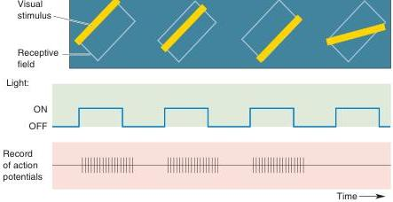

A complex cell receptive field. Like a simple cell, a complex cell responds best to a bar of light at a particular orientation. However, responses occur to both light ON and light OFF, regardless of position in the receptive field.

to be more complex than those of simple cells. Complex cells give ON and OFF responses to stimuli throughout the receptive field (Figure 10.24). Hubel and Wiesel proposed that complex cells are constructed from the input of several like-oriented simple cells. However, this remains a matter of debate.

Simple and complex cells are typically binocular and sensitive to stimulus orientation. While less is known about the mechanism, many are also direction selective. In general, they are relatively insensitive to the wavelength of light, although color sensitivity is sometimes observed.

**Blob Receptive Fields.** The old adage says, where there's smoke, there's fire. This idea appropriately describes the connection between structure and function in the brain. We have seen repeatedly in the visual system that when two nearby structures label differently with some anatomical technique, there is good reason to suspect the neurons in the structures are functionally different. For example, we have seen how the distinctive layers of the LGN segregate different types of input. Similarly, the lamination of striate cortex correlates with differences in the receptive fields of the neurons. The presence of the distinct cytochrome oxidase blobs outside layer IV of striate cortex immediately raises the question of whether the neurons in the blobs respond differently from interblob neurons. The answer is clearly yes. The neurons in the interblob areas have some or all of the properties we discussed above: binocularity, orientation selectivity, and direction selectivity. They are both simple cells and complex cells and generally are not wavelength sensitive. Most blob cells, on the other hand, are wavelength sensitive and monocular, and they lack orientation and direction selectivity. The blobs receive input directly from the koniocellular layers of the LGN and magnocellular and parvocellular input via layer IVC. The visual responses of blob cells most resemble those of the koniocellular and parvocellular input.

The receptive fields of most blob neurons are circular. Some have the color-opponent center-surround organization observed in the parvocellular and koniocellular layers of the LGN. Other blob cell receptive fields have red-green or blue-yellow color opponency in the center of their receptive fields, with no surround regions at all. Still other cells have both a color-opponent center and a color-opponent surround; they are called double-opponent cells. For present purposes, the most important thing to remember about blobs is that they contain the great majority of color-sensitive neurons outside layer IVC. Thus, the blob channels appear to be specialized for the analysis of object color. Without them, we might be color-blind.