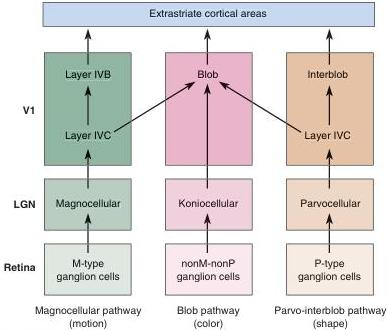

# Parallel Pathways and Cortical Modules

The anatomy and physiology of the central visual pathways, from retina to striate cortex, are consistent with the idea that there are several channels that process visual input in parallel. Each one appears to be specialized for the analysis of different facets of the visual scene. Dr. Margaret Livingstone and her colleagues at Harvard University have explored the fascinating correspondence between the organization of visual pathways and the receptive field properties of neurons (Box 10.3). On the basis of anatomy and physiology, we can distinguish a magnocellular pathway, a parvo-interblob pathway, and a blob pathway. These pathways are summarized in Figure 10.25. In addition to this segregation into parallel pathways, there appears to be modular processing in V1 based on retinotopy and the organization into ocular dominance columns, orientation columns, and blobs.

**Parallel Pathways.** The **magnocellular pathway** begins with M-type ganglion cells of the retina. These cells project axons to the magnocellular layers of the LGN. These layers project to layer IVCα of striate cortex, which in turn projects to layer IVB. The pyramidal cells in layer IVB have binocular receptive fields of the simple and complex types. They are orientation selective, and many are direction selective. They are generally not wavelength sensitive. Because this pathway contains neurons with transient responses, relatively large receptive fields, and the highest percentage of direction-selective neurons, it is thought to be involved in the *analysis of object motion and the guidance of motor actions*.

The **parvo-interblob pathway** originates with P-type ganglion cells of the retina, which project to the parvocellular layers of the LGN. The parvocellular LGN sends axons to layer IVCβ of striate cortex, which project to layer II and III interblob regions. These neurons are not generally direction selective or wavelength sensitive. The binocular receptive fields are orientation selective and simple or complex. Neurons in this pathway have the smallest

FIGURE 10.25

**Three parallel pathways reaching into primary visual cortex.** The function indicated below each pathway name is a "best guess" based on unique receptive field properties. Additional interactions between the pathways exist, but they are not shown.