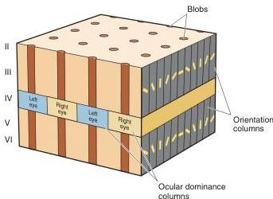

the analysis of fine object shape.

The origin of the **blob pathway** is more mixed than that of the magnocellular and parvo-interblob pathways. Unique input to the blob pathway arises from the subset of ganglion cells that are neither M-type cells nor P-type cells. These nonM-nonP cells project to the koniocellular layers of the LGN. The koniocellular LGN projects directly to the cytochrome oxidase blobs in layers II and III. The blobs are a site of convergence of parvocellular, magnocellular, and koniocellular inputs. Typical receptive fields in the blobs are center-surround and color-opponent. They are often monocular and lack orientation selectivity. The uniquely high incidence of wavelength sensitivity in the blobs suggests that the neurons are involved in the *analysis of object color*.

While parallel pathways are a compelling feature of the visual system, it is important to note that they are not “pure.” There is some mixing both within V1 and beyond, resulting in the interaction of signals from the magnocellular, parvo-interblob, and blob pathways. At present, we do not know whether this mixing is useless “contamination” that degrades information transmission within pathways or the source of valuable integration of different visual attributes.

**Cortical Modules.** Each point in the visual world is analyzed by thousands of cortical neurons. The retinotopic organization of the projections from retina to LGN to the primary visual cortex ensures that all the neurons analyzing a point in visual space are within a circumscribed patch of the cortex. Hubel and Wiesel showed that the image of a point in space falls within the receptive fields of neurons within a 2 × 2 mm region of layer III. For a complete analysis, this 2 × 2 mm patch of active neurons must include representatives from each of the processing channels from right and left eyes.

Fortunately, a 2 × 2 mm chunk of cortex would contain two complete sets of ocular dominance columns, 16 blobs, and, in the cells between blobs, a complete sampling (twice over) of all 180° of possible orientations. Thus, Hubel and Wiesel argued that a 2 × 2 mm chunk of striate cortex is both necessary and sufficient to analyze the image of a point in space, *necessary* because its removal would leave a blind spot for this point in the visual field and *sufficient* because it contains all the neural machinery required to analyze the participation of this point in oriented and/or colored contours viewed through either eye. Such a unit of brain tissue has come to be called a **cortical module**.

Striate cortex is constructed from perhaps a thousand cortical modules, and one is shown in Figure 10.26. We can think of a visual scene being

**FIGURE 10.26**

**A cortical module.** Each cortical module contains ocular dominance columns, orientation columns, and cytochrome oxidase blobs to fully analyze a portion of the visual field. The idealized cube shown here differs from the actual arrangement, which is not as regular or orderly.