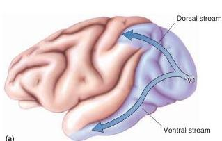
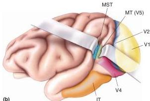
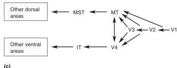

the scene. Just remember that the modules are an idealization. Optical images of V1 activity reveal that the regions of striate cortex responding to different eyes and orientations are not nearly as regular as the “icecube model” in Figure 10.26 suggests.

## ▼ BEYOND STRIATE CORTEX

Striate cortex is called V1, for “visual area one,” because it is the first cortical area to receive information from the LGN. Beyond V1 lie another two dozen distinct areas of cortex, each of which contains a representation of the visual world. The contributions to vision of these *extrastriate areas* are still being vigorously debated. However, the emerging picture is that there are two large-scale cortical streams of visual processing, one stretching dorsally from striate cortex toward the parietal lobe and the other projecting ventrally toward the temporal lobe (Figure 10.27).

The *dorsal stream* appears to serve the analysis of visual motion and the visual control of action. The *ventral stream* is thought to be involved in the perception of the visual world and the recognition of objects. These processing streams have primarily been studied in the macaque monkey brain, where recordings from single neurons can be made. However, functional magnetic resonance imaging (fMRI) research has begun to identify areas in the human brain that have properties analogous to brain areas in the macaque (Figure 10.28).

The dorsal and ventral streams in extrastriate cortex are related to the magnocellular, parvo-interblob, and blob pathways in V1. As we will see below, the properties of dorsal stream neurons are most similar to magnocellular neurons in V1, and ventral stream neurons have properties combining features of parvo-interblob and blob cells in V1. It appears to be a reasonable approximation to view the dorsal stream as an extension of the V1 magnocellular pathway and the ventral stream as an extension of V1 parvo-interblob and blob pathways. However, each extrastriate stream re-

FIGURE 10.27
Beyond striate cortex in the macaque monkey brain. (a) Dorsal and ventral visual processing streams. (b) Extrastriate visual areas. (c) The flow of information in the dorsal and ventral streams.