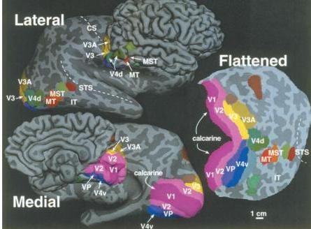

**Visual areas in the human brain, medial and lateral views.** For each view, next to the conventional picture of the brain is a 'computer-inflated' brain in which the sulci have been flattened to expose hidden cortex. On the right is a flattened map of the cerebral cortex with the visual areas colored. Visual areas are represented by their common abbreviation (V1, V2, V3, V4, MT, MST, IT). VP is the ventral posterior area. Sulci shown are the superior temporal sulcus (STS), calcarine fissure, and central sulcus (CS). (Source: Courtesy of Dr. M. Sereno.)

ceives some amount of input from all the pathways that are segregated in the primary visual cortex. Thus, the extrastriate streams appear to be *dominated by* input from particular V1 pathways rather than exclusive extensions of them.

## The Dorsal Stream

The cortical areas composing the dorsal stream are not arranged in a strict serial hierarchy, but there does appear to be a progression of areas in which more complex or specialized visual representations develop. Projections from V1 extend to areas designated V2 and V3, but we will skip farther ahead in the dorsal stream.

**Area MT.** In an area known as V5 or MT (because of its location in the middle temporal lobe in some monkeys), strong evidence indicates that specialized processing of object motion takes place. **Area MT** receives retinotopically organized input from a number of other cortical areas, such as V2 and V3, and it also is directly innervated by cells in layer IVB of striate cortex. Recall that in layer IVB the cells have relatively large receptive fields, transient responses to light, and direction selectivity. Neurons in area MT have large receptive fields that respond to stimulus movement in a narrow range of directions. Area MT is most notable for the fact that almost all the cells are direction-selective, unlike areas earlier in the dorsal stream, or anywhere in the ventral stream.

The neurons in MT also respond to types of motion, such as drifting spots of light, that are not good stimuli for cells in other areas—it appears that the motion of the objects is more important than their structure. Further specialization for motion processing is evident in the organization of MT. This cortical area is arranged into direction-of-motion columns analogous to the orientation columns in V1. Presumably, the perception of movement at any point in space depends on a comparison of the activity across columns spanning a full 360° range of preferred directions.

William Newsome and his colleagues at Stanford University have shown that weak electrical stimulation in area MT of the macaque monkey appears