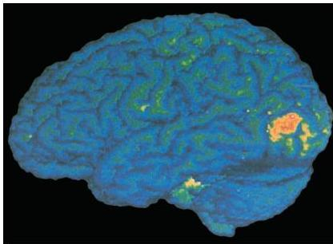

ple, if electrical stimulation is applied to cells in a direction column preferring rightward movement, the monkey makes behavioral decisions suggesting that it has perceived motion in that direction. The artificial motion signal from electrical stimulation in MT appears to combine with visual motion input. The fact that the monkey behaviorally reports a perceived direction of motion based on the combination suggests that MT activity plays an important role in motion perception.

**Dorsal Areas and Motion Processing.** Beyond area MT, in the parietal lobe, are areas with additional types of specialized movement sensitivity. For example, in an area known as *MST*, there are cells selective for linear motion (as in MT), radial motion (either inward or outward from a central point), and circular motion (either clockwise or counterclockwise). We do not know how the visual system makes use of neurons with complex motion-sensitive properties in MST or of the “simpler” direction-selective cells in V1, MT, and other areas. However, three roles have been proposed:

1. *Navigation:* As we move through our environment, objects stream past our eyes, and the direction and speed of objects in our peripheral vision provide valuable information that can be used for navigation.
2. *Directing eye movements:* Our ability to sense and analyze motion must also be used when we follow objects with our eyes and when we quickly move our eyes to objects in our peripheral vision that catch our attention.
3. *Motion perception:* We live in a world filled with motion, and survival sometimes depends on our interpretation of moving objects.

Striking evidence that cortical areas in the vicinity of MT and MST are critical for motion perception in humans comes from extremely rare cases in which brain lesions selectively disrupt the perception of motion. The clearest case was reported in 1983 by Josef Zihl and his colleagues at the Max Planck Institute for Psychiatry in Munich, Germany. Zihl studied a woman who experienced a stroke at the age of 43, bilaterally damaging portions of extrastriate visual cortex known to be particularly responsive to motion (Figure 10.29). Although some ill effects of the stroke were evident,

FIGURE 10.29

**Human brain activity in response to visual motion.** In this PET image, an area on the lateral surface of the occipital lobe (shown in red and yellow) is particularly active. (Source: Zeki, 1993, Plate 2.)