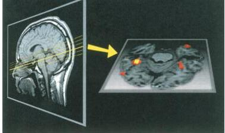

FIGURE 10.30

Human brain activity elicited by pictures of faces. Using fMRI, brain activity was recorded first in response to faces and second in response to nonface stimuli. The colored area in the brain section on the right showed significantly greater responses to faces. (Source: Courtesy of Drs. I. Gauthier, J. C. Gore, and M. Tarr.)

stimuli (Figure 10.30). The finding of face-selective cells has sparked much interest, in part because of a syndrome called prosopagnosia—difficulty recognizing faces even though vision is otherwise normal. This rare syndrome usually results from a stroke and is associated with damage to extrastriate visual cortex.

Could it be that our brains contain a group of cells highly specialized for face recognition? The answer is not known. While most scientists agree that faces are particularly good stimuli for a small percentage of cells, this does not mean that these cells are not involved in processing other types of information.

# ▼ FROM SINGLE NEURONS TO PERCEPTION

Visual perception—the task of identifying and assigning meaning to objects in space—obviously requires the concerted action of many cortical neurons. But which neurons in which cortical areas determine what we perceive? How is the simultaneous activity of widely separated cortical neurons integrated, and where does this integration take place? Neuroscience research is only just beginning to tackle these challenging questions. However, sometimes basic observations about receptive fields can give us insight into how we perceive (Box 10.4).

# From Photoreceptors to Grandmother Cells

Comparing the receptive field properties of neurons at different points in the visual system might provide insight about the basis of perception. The receptive fields of photoreceptors are simply small patches on the retina, whereas those of retinal ganglion cells have a center-surround structure. The ganglion cells are sensitive to variables such as contrast and the wavelength of light. In striate cortex, we encounter simple and complex receptive fields that have several new properties, including orientation selectivity and binocularity. We have seen that in extrastriate cortical areas, cells are selectively responsive to more complex shapes, object motion, and even faces. It appears that the visual system consists of a hierarchy of areas in which