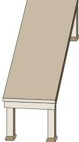
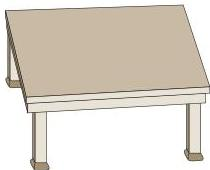
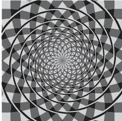
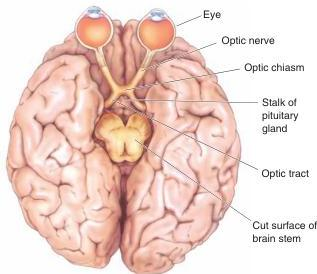

(a)

(b)

away from the cortex, and the retinofugal projection goes away from the retina.

We begin our tour of the central visual system by looking at how the retinofugal projection courses from each eye to the brain stem on each side, and how the task of analyzing the visual world initially is divided among, and organized within, certain structures of the brain stem. Then we focus on the major arm of the retinofugal projection that mediates conscious visual perception.

FIGURE 10.1

**Perceptual illusions.** (a) The two tabletops are of identical dimensions and are imaged on similarly sized patches of retina, but the perceived sizes are quite different. (b) This is an illusory spiral. Try tracing it with your finger.

## The Optic Nerve, Optic Chiasm, and Optic Tract

The ganglion cell axons “fleeing” the retina pass through three structures before they form synapses in the brain stem. The components of this retinofugal projection are, in order, the optic nerve, the optic chiasm, and the optic tract (Figure 10.2). The **optic nerves** exit the left and right eyes

FIGURE 10.2

**The retinofugal projection.** This view of the base of the brain shows the optic nerves, optic chiasm, and optic tracts.