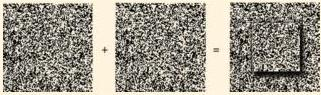
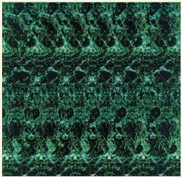

FIGURE B

A random-dot stereogram and the perception that results from binocularly fusing the images. (Source: Julesz, 1971, p. 21.)

commonly thought that depth was perceived only after the images in each eye were separately recognized.

In the 1970s, Christopher Tyler at the Smith-Kettlewell Eye Research Institute created autostereograms. An autostereogram is a single image that, when properly viewed, gives the perception of objects in 3D (Figure C). The colorful, and sometimes frustrating, autostereograms you see in books are based on an old illusion called the wallpaper effect. If you look at wallpaper that contains a repeating pattern, you can cross (or diverge) your eyes and view one piece of the pattern with one eye and the next cycle of the pattern with the other eye. The effect makes the wallpaper appear to be closer (or farther away). In an autostereogram, the wallpaper effect is combined with random-dot stereograms. To see the 3D skull in Figure C, you need to relax your eye muscles so that the left eye looks at the left dot on top and the right eye the right dot. You will know you are getting close when you see three dots at the top of the image. Relax and keep looking, and the picture will become visible.

FIGURE C

An autostereogram. (Source: Horibuchi, 1994, p. 54.)

One of the fascinating things about stereograms is that you often must look at them for tens of seconds or even minutes, while your eyes become “properly” misaligned and your visual cortex “figures out” the correspondence between the left and right eye views. We do not know what is going on in the brain during this period, but presumably it involves the activation of binocular neurons in the visual cortex.

other properties. For example, we can focus on the orientation selectivity of V1 neurons and the way in which this might relate to the perception of form, neglecting the fact that the same cells might selectively respond to size, direction of motion, and so on. Finally, it might be too “risky” for the nervous system to rely on extreme selectivity. A blow to the head might kill all five grandmother cells, and in an instant, we would lose our ability to recognize her.

## Parallel Processing and Perception

If we do not rely on grandmother cells, how does perception work? One alternative hypothesis is formulated around the observation that parallel processing is used throughout the visual system (and other brain systems). We encountered parallel processing in Chapter 9 when we discussed ON and OFF and M and P ganglion cells. In this chapter, we saw three parallel channels in V1. Extending away from V1 are dorsal and ventral streams of processing, and the different areas in these two streams are biased, or specialized, for various stimulus properties. Perhaps the brain uses a “division of labor” principle for perception. Within a given cortical area, many broadly