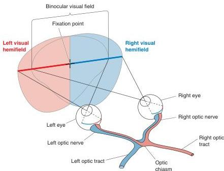

bony orbits, then pass through holes in the floor of the skull. The optic nerves from both eyes combine to form the **optic chiasm** (named for the X shape of the Greek letter chi), which lies at the base of the brain, just anterior to where the pituitary gland dangles down. At the optic chiasm, the axons originating in the nasal retinas cross from one side to the other. The crossing of a fiber bundle from one side of the brain to the other is called a **decussation**. Because only the axons originating in the nasal retinas cross, we say that a partial decussation of the retinofugal projection occurs at the optic chiasm. Following the partial decussation at the optic chiasm, the axons of the retinofugal projections form the **optic tracts**, which run just under the pia along the lateral surfaces of the diencephalon.

## Right and Left Visual Hemifields

To understand the significance of the partial decussation of the retinofugal projection at the optic chiasm, let's review the concept of the visual field introduced in Chapter 9. The full visual field is the entire region of space (measured in degrees of visual angle) that can be seen with both eyes looking straight ahead. Fix your gaze on a point straight ahead. Now imagine a vertical line passing through the fixation point, dividing the visual field into left and right halves. By definition, objects appearing to the left of the midline are in the left **visual hemifield**, and objects appearing to the right of the midline are in the right visual hemifield (Figure 10.3).

By looking straight ahead with both eyes open and then alternately closing one eye and then the other, you will see that the central portion of both visual hemifields is viewed by *both* retinas. This region of space is therefore called the **binocular visual field**. Notice that objects in the binocular region of the left visual hemifield will be imaged on the nasal retina of the left eye and on the temporal retina of the right eye. Because the fibers from the nasal portion of the left retina cross to the right side at the optic chiasm, all the information about the left visual hemifield is directed to the right side of the brain. Remember this rule of thumb: Optic nerve fibers cross in

FIGURE 10.3

### Right and left visual hemifields.

Ganglion cells in both retinas that are responsive to visual stimuli in the right visual hemifield project axons into the left optic tract. Similarly, ganglion cells 'viewing' the left visual hemifield project into the right optic tract.