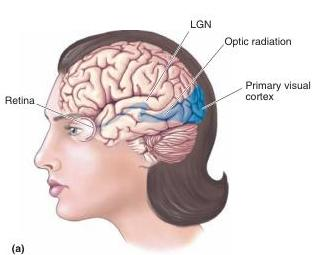
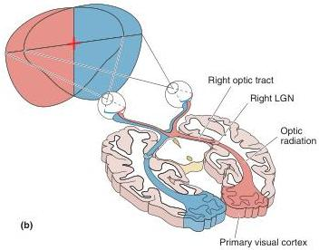

sphere and the right visual hemifield is "viewed" by the left hemisphere.

## Targets of the Optic Tract

A small number of optic tract axons peel off to form synaptic connections with cells in the hypothalamus, and another 10% or so continue past the thalamus to innervate the midbrain. But most of them innervate the lateral geniculate nucleus (LGN) of the dorsal thalamus. The neurons in the LGN give rise to axons that project to the primary visual cortex. This projection from LGN to cortex is called the optic radiation. Lesions anywhere in the retinofugal projection from eye to LGN to visual cortex cause blindness in humans. Therefore, we know that it is this pathway that mediates conscious visual perception (Figure 10.4).

From our knowledge of how the visual world is represented in the retinofugal projection, we can predict the types of perceptual deficits that would result from its destruction at different levels, as might occur from a traumatic injury to the head, a tumor, or an interruption of the blood supply. As shown in Figure 10.5, while a transection of the left optic nerve would render a person blind in the left eye only, a transection of the left optic tract would lead to blindness in the right visual field as viewed through either eye. A midline transection of the optic chiasm would affect only the fibers that cross the midline. Because these fibers originate in the nasal portions of both retinas, blindness would result in the regions of the visual field viewed by the nasal retinas, that is, the peripheral visual fields on both sides (Box 10.1). Because unique deficits result from lesions at different sites, neurologists and neuro-ophthalmologists can locate sites of damage by assessing visual field deficits.

Nonthalamic Targets of the Optic Tract. As we have said, some retinal ganglion cells send axons to innervate structures other than the LGN. Direct projections to part of the hypothalamus play an important role in synchronizing a variety of biological rhythms, including sleep and wakefulness, with the daily dark-light cycle (see Chapter 19). Direct projections to part

FIGURE 10.4

The visual pathway that mediates conscious visual perception. (a) A side view of the brain with the retinogeniculocortical pathway shown inside (blue). (b) A horizontal section through the brain exposing the same pathway.