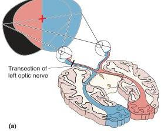
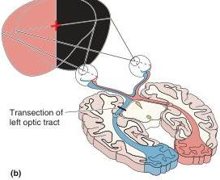
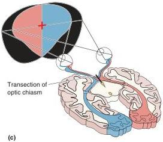
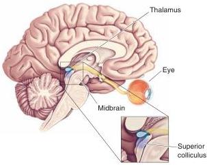

FIGURE 10.5
Visual field deficits from lesions in the retinofugal projection. (a) If the optic nerve on the left side is cut, vision will be lost completely in the left eye. The right eye still sees a portion of the left visual field. (b) If the optic tract on the left side is cut, vision will be lost in the right visual field of each eye. (c) If the optic chiasm is split down the middle, only the crossing fibers will be damaged, and peripheral vision will be lost in both eyes.

of the midbrain, called the *pretectum*, control the size of the pupil and certain types of eye movement. And about 10% of the ganglion cells in the retina project to a part of the midbrain tectum called the **superior colliculus** (Latin for "little hill") (Figure 10.6).

While 10% may not sound like much of a projection, bear in mind that in primates, this is about 150,000 neurons, which is equivalent to the *total*

FIGURE 10.6
The **superior colliculus**. Located in the tectum of the midbrain, the superior colliculus is involved in generating saccadic eye movements, the quick jumps in eye position used to scan across a page while reading.