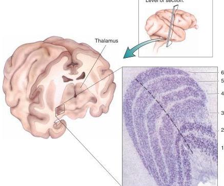

## The LGN of the macaque monkey.

The tissue has been stained to show cell bodies, which appear as purple dots. Notice particularly the six layers and the larger size of the cells in the two ventral layers (layers 1 and 2). (Source: Adapted from Hubel, 1988, p. 65.)

The LGN is the gateway to the visual cortex and, therefore, to conscious visual perception. Let's explore the structure and function of this thalamic nucleus.

## The Segregation of Input by Eye and by Ganglion Cell Type

LGN neurons receive synaptic input from the retinal ganglion cells, and most geniculate neurons project an axon to primary visual cortex via the optic radiation. The segregation of LGN neurons into layers suggests that different types of retinal information are being kept separate at this synaptic relay, and indeed this is the case: Axons arising from M-type, P-type, and nonM-nonP ganglion cells in the two retinas synapse on cells in different LGN layers.

Recall from our rule of thumb that the *right* LGN receives information about the *left* visual field. The left visual field is viewed by both the nasal left retina and the temporal right retina. At the LGN, input from the two eyes is kept separate. In the right LGN, the right eye (ipsilateral) axons synapse on LGN cells in layers 2, 3, and 5. The left eye (contralateral) axons synapse on cells in layers 1, 4, and 6 (Figure 10.8).

A closer look at the LGN in Figure 10.7 reveals that the two ventral layers, 1 and 2, contain larger neurons, and the four more dorsal layers, 3 through 6, contain smaller cells. The ventral layers are therefore called **magnocellular LGN layers**, and the dorsal layers are called **parvocellular LGN layers**. Recall from Chapter 9 that ganglion cells in the retina may also be classified into magnocellular and parvocellular groups. As it turns out, P-type ganglion cells in the retina project exclusively to the parvocellular LGN, and M-type ganglion cells in the retina project entirely to the magnocellular LGN.

In addition to the neurons in the six principal layers of the LGN, numerous tiny neurons also lie just ventral to each layer. Cells in these **konio-**