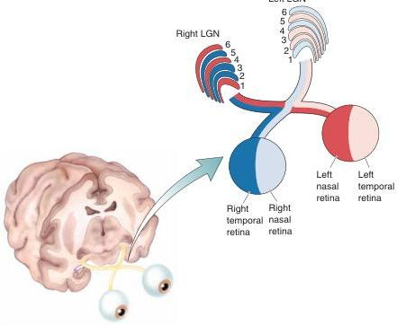

Retinal inputs to the LGN layers.

cellular layers (konio is from the Greek for “dust”) receive input from the nonM-nonP types of retinal ganglion cells and also project to visual cortex. Note that the koniocellular layers are not uniquely numbered, because historically, the six thick layers were numbered before cells in the koniocellular layers were discovered. In Chapter 9, we saw that in the retina, M-type, P-type, and nonM-nonP ganglion cells respond differently to light and color. In the LGN, the different information derived from the three categories of retinal ganglion cells from the two eyes remains segregated.

The anatomical organization of the LGN supports the idea that the retina gives rise to streams of information that are processed in parallel. This organization is summarized in Figure 10.9.

## Receptive Fields

By inserting a microelectrode into the LGN, it is possible to study the action potential discharges of geniculate neurons in response to visual stimuli, just as was done in the retina. The surprising conclusion of such studies is that the visual receptive fields of LGN neurons are almost identical to those of the ganglion cells that feed them. For example, magnocellular LGN neurons have relatively large center-surround receptive fields, respond to stimulation of their receptive field centers with a transient burst of action potentials, and are insensitive to differences in wavelength. All in all, they are just like M-type ganglion cells. Likewise, parvocellular LGN cells, like P-type retinal ganglion cells, have relatively small center-surround receptive fields and respond to stimulation of their receptive field centers with a sustained increase in the frequency of action potentials; many of them exhibit color opponency. Receptive fields of cells in the koniocellular layers are center-surround and have either light/dark or color opponency. Within all layers of the LGN, the neurons are activated by only one eye (i.e., they are monocular) and ON-center and OFF-center cells are intermixed.